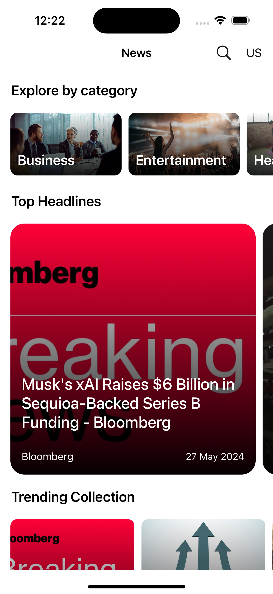
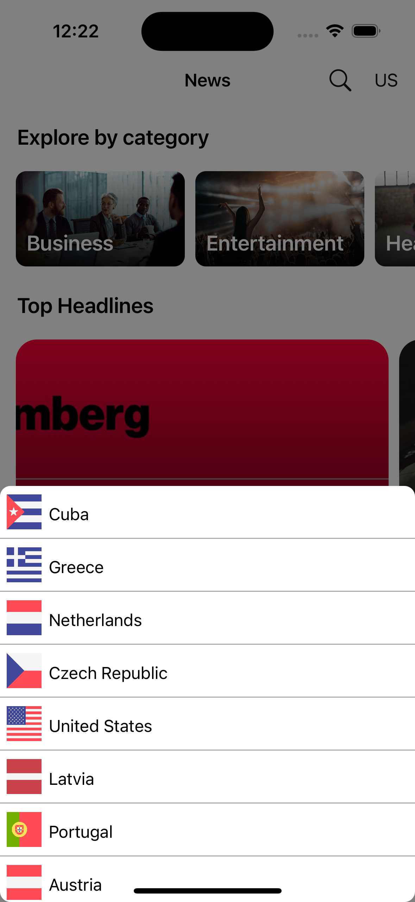
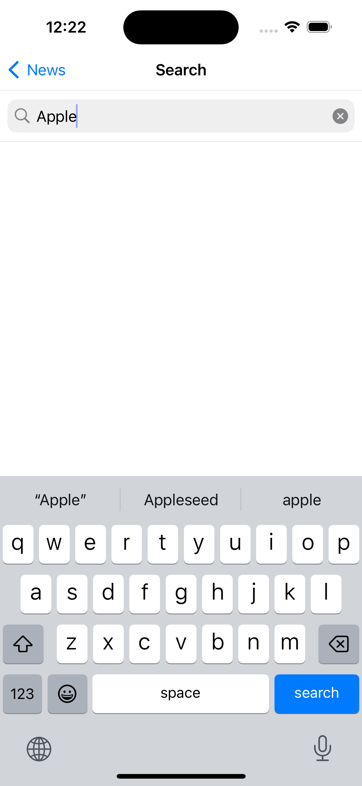
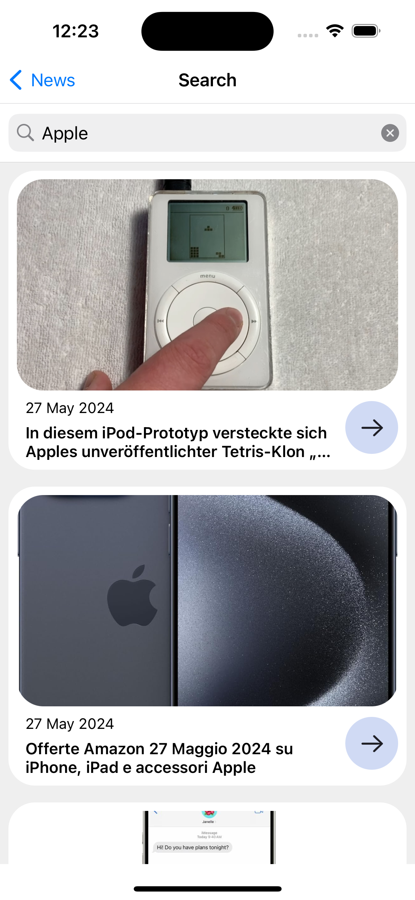

<h3>NEWS App - UIKit</h3>
<hr>

NEWS App - UIKit is a news app that uses NEWSAPI.org and is built with UIKit. Get the latest news and articles from the different countries and populate them in UI.
<br/><br/><br/>
<h3>Tech Used</h3>
<hr>
<ul>
  <li>Designed with MVC architecture</li>
  <li>Swift 5</li>
  <li>UIKit</li>
  <li>JSON & Codable</li>
  <li>newsapi.org</li>
  <li>XCode 15</li>
</ul>
<br/><br/>
<h3>Installation</h3>
<ol>
  <li>Clone or download the project to your local machine</li>
  <li>Open the project in XCode.</li>
  <li>Replace <code>"YOUR API HERE"</code> with your valid newsapi.org Key in <code>NetworkAPI.swift</code><br></li><br>
  
  ```
    extension QueryParams {
    var apiKey      : String    {return "YOUR API HERE"}

  ```
    
  <li>Run the simulator.</li>
</ol>
<br>
<h3>Screens</h3>
<hr>
<div style="float:left">






</div>
